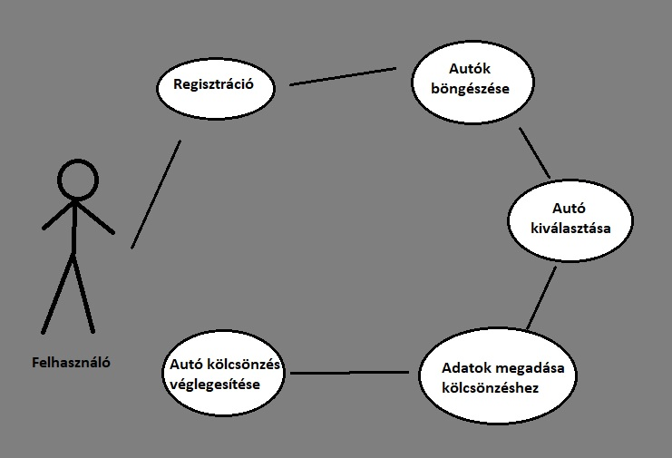

# Funkcionális Specifikáció
## 1.) Áttekintés
## 2.) Jelenlegi helyzet
## 3.) Követelménylista
## 4.) Követelmények
### Funkcionális követelmények:
- **Kölcsönzők adminisztrációja:** Kölcsönzők regisztrálása, törlése az igényelt üzleti folyamatokban leírtak szerint.  
- **Autók adminisztrációja:** Autók regisztrálása, törlése az igényelt üzleti folyamatokban leírtak szerint.
- **Kölcsönzés adminisztrációja:** Kölcsönzések folyamatának kezelése az igényelt üzleti folyamatokban leírtak szerint.
- **Felhasználói fiókok kezelése:** Bejelentkezés, felhasználói adatok módosítása, intézők, kölcsönzők rögzítése az adatbázisban, listák és kimutatások készítése az igényelt üzleti folyamatokban leírtak szerint.  
- **Platformfüggetlen, robusztus működés:** Szabványos, az iparágban régóta bevált, operációs rendszertől független technológiák használata: Php, Apache HTTP szerver, MySQL.   
- **Költséghatékony üzemeltetés:** A szabványos és elterjedt technológiák használata biztosítja. 
- **Bővíthetőség:** A kezelt adatok mennyiségének, valamint a felhasználók számának bővíthetősége és utólag újabb funkciók hozzáadásának lehetőségének biztosítása.
### Nem Funkcionális követelmények:
- **Látványos** és egyedülálló dizájn
- **Egyszerű**, gyorsan értelmezhető, letisztult, egyszerűen használható felhasználói felület
- **Online elérhető nyilvános katalógus:** Bárki számára elérhető online felület készítése, amin keresztül elérhető, böngészhető és kereshető a kölcsönözhető autók katalógusának tartalma.
- Részfeladatok megfelelő megjelenítése
## 5.) Jelenlegi üzleti folyamatok modellje
Üzleti szereplők: 	
-	kölcsönző

Üzleti munkatárs: 	
-	eladó

Üzleti entitások: 		
-	személyes iratok
-	autó
-	kaució
-	kartoték

Üzleti folyamatok: 	
-	Új gépjármű felvétele a rendszerbe: eladó aaz autó adatait felviszi a rendszerbe (kategória, márka, típus, felszereltség, évjárat, szín, meghajtás, férőhely, klíma, üzemanyag, váltó, abs, szervó) => a felvitt adatokat kinyomtatja => a kinyomtatott iratot egy fiókba helyezi kategória és név szerint szortírózva.
-	Új kölcsönző regisztrálása: eladó az új kölcsönző adatait feltölti a rendszerbe => az adatokat egy regisztrációs lapra kinomtatja és kartoték rendezőbe helyezi név szerinti ábécé sorrendben.
-	Gépjármű keresése: kölcsönző a weboldalon kölcsönzés kezdete, kölcsönzés vége dátumokat megadja => kiválasztja a kölcsönözni kívánt autó kategóriáját.
-	Kölcsönzés – autó kivétele: eladó kiveszi az autó adatait tartalmazó lapot => a lap hátulján lévő táblázatban rögzíti a kölcsönző személy személyes iratait => a lapot a kölcsönzőhöz tartozó kartotékba helyezi kölcsönzésének lejárati határideje szerint rendezve => az eladó rögzíti a kölcsönzött autó azonosítóját és a kölcsönzési határidőt és a kölcsönző a kaucitót leteszi.
-	Kölcsönzés - autó visszavétele: kölcsönző átadja az autót és a kölcsönzésről szóló iratot az eladónak => eladó az iraton regisztrálja a visszavétel tényét és a kauciót visszaadja a kölcsönzőnek => a kölcsönző kartotékjából az autóhoz tartozó lapot kiveszi és rögzíti rajta a visszavételt = > lapot visszahelyezi a többi kölcsönözhető autók közé.

## 6.) Igényelt üzleti folyamatok
1. A felhasználó a főoldalon fog látni autókkal kapcsolatos híreket.
2. A navigációs sáv gombjaival átírányíthatja magát a felhasználó a kölcsönzés vagy a regisztració/bejelentkezés szekcióra.
3. Az átirányítást követően már láthatja is a kívánt oldalt.
4. Ha a felhasználó felregisztrált be kell jelentkezni-e, hogy kölcsönözni tudjon.
5. Egy autó kiválasztása során azt könnyedén kikölcsönözheti.

## 7.) Használati esetek

### Felhasználó
- Be regisztrálhat, bejelentkezhet
- Kölcsönözhető autók között böngészhet
- Személyes adatok módosítása
- Keresés funkció használata
## 8.) Megfeleltetés, hogyan fedik le a használati esetek a követelményeket
- Első feladat: Képválasztás, ki kell választani a megfelelő képeket szöveg alapján
- Több kép is megjelenik egymást követően
- Pontszámok összesítése
- Next
- Második feladat: Matematikai feladat megoldása
- Egymás után több, különböző operátorokkal és operandusokkal
- A felhasználó csak az eredményt írja be
- Pontszámok összesítése
- Next
- Harmadik feladat: kép alapján kiválasztani, mi van rajta
- Checkboxokat kell kipipálni
- Pontszámok összesítése
- Next
- Végeredmény

## 9.) Képernyőtervek
## 10.) Forgatókönyv
## 11.) Funkció-követelmény megfeleltetés
### Funkciókövetelmények megfeleltetés:
### Nem Funkció-követelmény megfeleltetés:
## 12.) Fogalomszótár
- Akkumulátorról hajtott jármű(BEV) - Olyan elektromos hajtású gépjármű amelynek egyedüli energiaforrásául – szemben a hibridmodellekkel és a „Range Extender” technológiával működő elektromos járművekkel – kizárólag akkumulátora szolgál (Battery Electric Vehicle; BEV). Az Audi e-tron például jellegzetes BEV-jármű.
 
 - ETA - Jelentése: VÁRHATÓ ÉRKEZÉSI IDŐ (ETA) az az idő, amikor egy hajó, jármű, repülőgép, rakomány, sürgősségi szolgálat vagy személy várhatóan egy bizonyos helyre érkezik.
 
 - Felhő - Internet kapcsolattal igénybe vehető adattároló szolgáltatás. A szolgáltatás nem egy dedikált hardvereszközön üzemel hanem a szolgáltató eszközein az üzemeltetés részleteit a felhasználótól elrejtve
 
 - Hibrid jármű - A Hibrid jármű (rövidítése HEV vagyis Hybrid Electric Vehicle) olyan hibridüzemű elektromos jármű jelölése amelynek hajtásáról belsőégésű és elektromos motor kombinációja gondoskodik.
## 13.) A rendszer céljai és nem céljai
